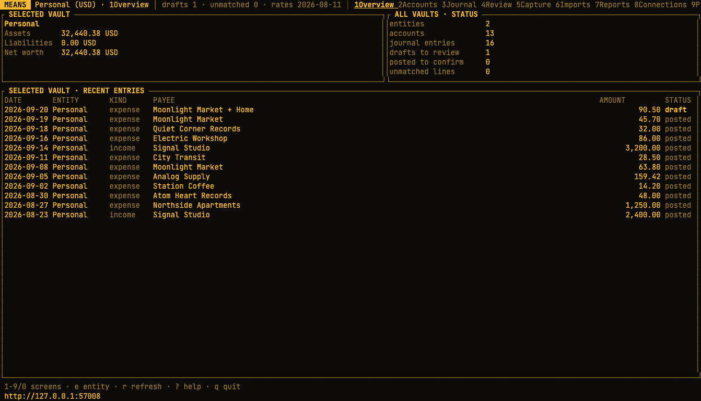
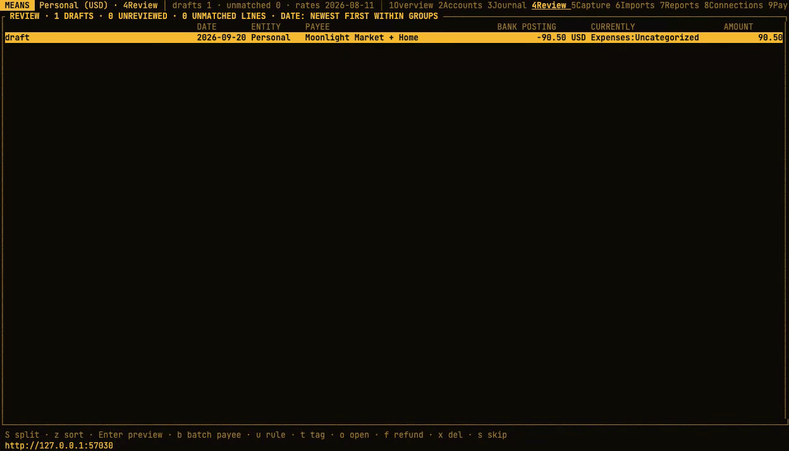
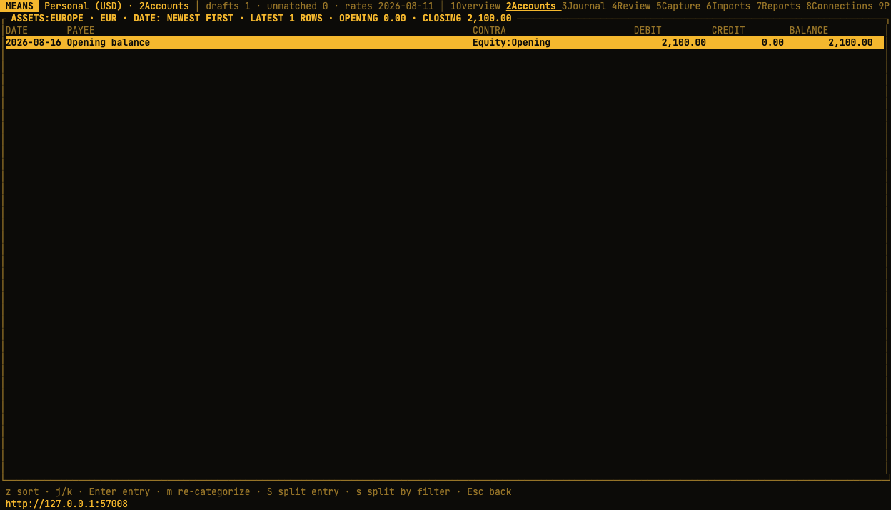
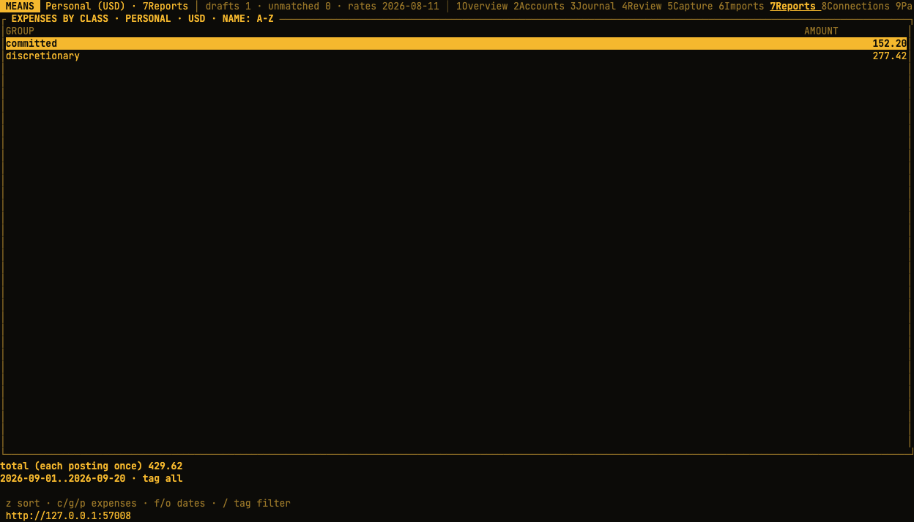

# means

Books that survive an audit. Local double-entry accounting across entities and currencies, with a terminal UI and a CLI. Your ledger lives in a SQLite file on your computer.



*Captured from the running TUI with fictional demo data.*

- **Engine**: Rust, SQLite file, double-entry journal per entity, functional-currency valuation, immutable statement lines as evidence, hash-chained entries.
- **Imports**: Account Tracker Pro backups and bank exports, plus Pluggy, Enable Banking, Mercury, Wise business and Banco Inter PJ API pulls, and email attachments through IMAP. Rules draft or post entries; matching links captured entries to bank evidence.
- **Terminal workflows**: capture, review, accounts, imports, bank connections, reconciliation, and reports. The CLI also supports chart maintenance, import retries, and Beancount export.

The TUI connects to a local gRPC server. CLI commands use the accounting core directly and do not require a running server. There is no web interface.

## In the terminal

Split an imported purchase between categories, preview every posting, then confirm.
The bank posting and its statement evidence stay linked.



<details>
<summary>See the account ledger and expense report</summary>

Browse an account’s transactions, newest first, with the balance after each posting.



View spending by expense class in the vault’s accounting currency.



</details>

## Build and install

Requires a recent stable Rust (rustup) and `protoc`.

```sh
cargo build --release
./target/release/means --help
cargo install --path crates/means-server --locked
```

The install step puts `means` in Cargo's binary directory, normally `~/.cargo/bin`. Add that directory to your `PATH`, or use `./target/release/means` in the examples below.

After updating the code, rebuild or reinstall the executable you actually launch.
Restart both the server and TUI with the updated binary, keeping the same `--db`
and `--server` settings. An already-running session continues using the old code. Plain `cargo build` only
updates `target/debug/means`: to launch it, use `./target/debug/means`. To update
the `means` command on PATH, run `cargo install --path crates/means-server --locked --force`
and check its location with `command -v means`.

## First run

Create a set of books and apply a chart from this repository:

```sh
means entity add Personal --currency EUR --country PT
means chart apply --entity Personal charts/personal-nomad.json
means status
```

Start the engine in one terminal:

```sh
means serve                   # ledger at ~/.means/ledger.db
```

Open the TUI in another terminal:

```sh
means tui                     # connects to http://127.0.0.1:7770
```

Use `--db PATH` (or `MEANS_DB`) on the server and CLI commands to choose a ledger. The TUI uses the server's ledger; select a server with `means tui --server URL`. For example:

```sh
means --db ./personal.db serve --listen 127.0.0.1:7771 --inbox ./inbox
# In another terminal:
means tui --server http://127.0.0.1:7771
```

Fetch exchange rates with `means rates fetch --from YYYY-MM-DD` for the period you need. Import a backup or bank file through the CLI or the TUI Imports screen. Use `means accounts --entity 1` to find account IDs for bank imports; replace `1` with the ID from `means entity list`.

## Local server and terminal workflows

The API is local-only: non-loopback listeners are refused. It accepts native gRPC
clients and rejects browser-origin and gRPC-web requests before RPC dispatch.
Host checks remain enforced. This release trusts local processes and does not
provide remote authentication or a supported reverse-proxy deployment.

Enable Banking connection setup opens a bank authorization page and receives a local callback. This browser step remains part of bank setup.

**The inbox**: while the engine runs, any bank export dropped into `~/.means/inbox/` imports itself — into the account learned from your earlier imports of that source, or held as *pending* for one keystroke on the TUI's Imports screen (Enter picks the account; the choice is remembered, including per filename shape when one bank feeds several accounts). Processed files move to `inbox/done/`; a file is never processed twice.

Run `means profiles` (or `means profiles list`) to inspect learned inbox routes. `(all filenames)`
is a source-wide fallback; a more specific matching filename pattern takes precedence. Deleting
one profile leaves other matching routes active. With no matching route, the next file waits for
account selection on Imports; assigning the correct account teaches a new route. Pluggy routes by
its separate account connections, so those are not listed as learned filename profiles.

**Splitting a category**: open its account ledger and press `s`. Enter text from a payee,
description, or posting memo, choose the destination category, then confirm the preview count.
The filter covers the whole account. The move is atomic; locked or reconciled source postings
and different-commodity destinations are refused.

**TUI Review**: drafts need an account; automatically posted entries appear as *unreviewed*. Press Enter to confirm the selected unreviewed entry, or `o` to inspect it first. Confirmation records your review without changing the postings.

## Importing

| Source | Files | Notes |
|---|---|---|
| Account Tracker Pro | `.atb` backup | Accounts, categories, transactions, splits, foreign amounts, repeats (expanded, then scheduled). Re-importing a newer backup adds only what is new. |
| N26, Revolut, Wise, Mercury | CSV exports | Detected from the header row. |
| Banco Inter | OFX (preferred) or CSV extrato | |
| Remessa Online | CSV extrato | Each row becomes a draft exchange between the BRL account and the foreign-currency account; the bank lines then match it. |
| Anything else | CSV | Map columns and preview parsed rows in the TUI. |

Every file is kept and hashed. The same file is never processed twice, overlapping statements only add new lines, and every posting created from a line links back to it.

Press **8** in the TUI for **Connections**. Discover and map Pluggy, Mercury checking/savings or IO, Enable Banking, Wise business and Banco Inter PJ accounts, then start a background pull and move to Review. Credentials remain in the server environment. See [TUI connection setup](docs/connections.md) and [bank formats and API channels](docs/import-formats.md). MeuPluggy uses one item per bank authorization; pulls read its current data and depend on Meu Pluggy's own syncing for freshness.

Press **9 → Payees** to manage canonical names and aliases, preview conflicts, and explicitly link history. Renames preserve booked text and ledger hashes. **7 → Reports → p** groups expenses by payee. See [payee setup and historical linking](docs/payee-aliases.md).

On the TUI Imports screen, press `i` and enter a file path. Bank files ask for a destination account, then show a preview. For unrecognized CSV files, map the date and signed amount (or debit/credit) columns. Use Tab to move between fields, Left/Right to select a header, Ctrl-U to clear a field, and Ctrl-P to preview. Optional fields cover descriptions, references, balances, currencies, date formats, and decimal separators. Press `y` on the preview to import; Escape returns to the mapping without writing.

Account Tracker backups open a per-account mapping screen. Use `e` to cycle the destination entity, `t` to cycle account type/subtype, and `x` to skip an account. Automatic types use the importer's existing defaults. `r` toggles recurring expansion; `s` toggles scheduled templates. Enter reviews the mapping, then `y` imports. The result shows warnings and balance checks. Existing imported accounts keep their ledger mapping. The CLI still imports a backup into one selected entity.

## CLI

```sh
means import retry 42                           # resume unfinished/error bank lines from stored evidence
means rematch 42 --cross-source --preview        # inspect exact CSV/API overlaps; apply with the returned token
means draft delete 123                          # drafts only; bank evidence remains unmatched
means void 4213 --reason "Duplicate purchase"     # preview a posted-entry reversal
means void 4213 --reason "Duplicate purchase" --yes  # apply; optional --date YYYY-MM-DD
means entity add Personal --currency EUR --country PT
means entity add LLC --currency USD --kind company --country US
means import --entity 1 backup.atb                # Account Tracker into one entity
means import --account 12 statement.csv           # bank file into account 12, source auto-detected
means rates fetch --from 2021-01-01               # ECB reference rates, then revalue postings booked without a rate
means accounts --entity 1
means reconcile --account 12                      # statement versus ledger, unmatched lines and unreconciled postings
means entries --entity Personal --status draft    # the journal, newest first, each entry with its postings
means entries --entity Personal --json            # one JSON object per line; count on stderr
means report expenses --entity 1 --from 2026-09-01 --to 2026-09-30 --tag trip:porto --json
means report expenses --entity 1 --group-by tag
means budget create --entity 1 --name Porto --tag trip:porto --amount 600 --from 2026-09-01 --to 2026-11-30
means budget list --entity 1 --json
means post 4213 --to Expenses:Domains             # a draft's Uncategorized posting moves to that account
means post 4214 --to "Expenses:Groceries=72.40" --to "Expenses:Household"  # final leg takes the rest
means rule list --entity Personal                 # the bank rules, in the order they run
means rule add --entity Personal --contains namecheap --to Expenses:Domains  # appended after the last rule
means rule delete 95
means profiles                                    # learned inbox routes: source, filename pattern, account, hits
means profiles delete 3                           # forget a wrong route (does not undo past imports)
means status
means verify                                      # recompute every entity's hash chain
means chart apply --entity "Personal" charts/personal-nomad.json          # create a chart template's accounts (existing ones kept, coded)
means chart remap --dry-run charts/remap/example.json            # preview a remap plan; drop --dry-run to apply it atomically
```

`means entries --json` emits posting quantities and booked amounts as structured Money objects, for example `{"minor":"125","commodity":"EUR","precision":2}` means EUR 1.25. Minor units are strings to preserve exact integers in JavaScript. Quantity uses the account commodity; amount uses the entity’s functional currency.

Overview shows net worth and recent entries for the selected vault. Press `e` to change vaults. Its default reporting currency is that vault’s accounting currency. Company balances do not count as personal assets just because both vaults are in the same file. The status counts are labelled **all vaults**.

An account can use a different currency from its vault. For example, a personal USD vault can contain EUR bank accounts and EUR expense categories. Each posting keeps its native quantity and a separate USD book value. Changing the selected vault does not convert or migrate its books.

To change an existing vault’s accounting currency, use `means entity migrate-currency --entity Personal --to USD`. This defaults to a read-only JSON preview. Apply requires the preview token and a new, verified backup. See the [accountant’s rehearsal instructions](docs/currency-migration.md).

Pluggy pulls accept `--booked-from YYYY-MM-DD` to exclude an account's existing CSV coverage and `--account ACCOUNT_UUID` to select one provider account. The booking cutoff is inclusive; `--since` instead filters when Pluggy recorded transactions. See [Pluggy imports and overlap review](docs/import-formats.md#pluggy-pluggy_json).

`means report expenses` groups expense postings by account class, or by tag with `--group-by tag`. Tag rows overlap; the total counts each posting once. It uses booked amounts in the entity’s functional currency. The dates are inclusive. An optional `--tag` selects one exact entry tag. See [expense report and budget semantics](docs/expense-reports.md).

Budgets set one limit for a chosen date range, defaulting to a calendar month, with no rollover. Target an expense category (including subcategories), an expense class, or an exact tag. In TUI Reports, press `u` for budgets, `n` to create, Enter to edit, and `v` to group by class or tag. Press `c`/`g` for expense reports by class/tag.

`means reconcile --account ID` is read-only. For an account path, use `--entity Personal --account Assets:Bank:N26`. Balances use the statement closing date when available; missing statement balances remain unknown. The report shows up to 500 unmatched lines and unreconciled postings from up to 5,000 ledger rows, matching the existing reconciliation report.

Export booked balances to Beancount/Fava with `means export --format beancount --output books.beancount`. See [export semantics and validation](docs/export.md).

## Development

```sh
cargo fmt --all --check
cargo clippy --workspace --all-targets -- -D warnings
cargo test --workspace                            # core, importers, server, and TUI
MEANS_ATB=/path/to/backup.atb cargo test -p means-core --test pipeline account_tracker_real_backup -- --ignored --exact   # explicit opt-in; use a private terminal
```

| Path | Purpose |
|---|---|
| `crates/means-core` | Ledger, valuation, imports, and reports |
| `crates/means-proto` | Generated Rust protobuf stubs |
| `crates/means-server` | Local native gRPC service and CLI; builds `means` |
| `crates/means-tui` | Ratatui terminal client |
| `proto/` | Shared API contract |
| `charts/` | Chart templates and remap plans |
| `docs/` | Design records and format documentation |

Project tasks use Beads (`bd`). Run `bd ready` to find available work and `bd prime` for the workflow.

## Documentation

The documentation website lives in [`website/`](website/README.md). It includes
installation, terminal workflows, searchable guides, and contributor docs.
Run `cd website && npm ci && npm run dev` with Node.js 24 LTS for a local preview.

- [Data model and architecture decisions](docs/data-model.md)
- [Schema diagram](docs/erd.md)
- [Account Tracker backup format](docs/account-tracker-backup.md)
- [Bank imports, API connections, refunds, and email ingestion](docs/import-formats.md)
- [Expense reports](docs/expense-reports.md)
- [TUI bank connections](docs/connections.md)
- [Beancount export](docs/export.md)

## Where this goes

A **vault** is one entity's books. **0 → Sharing** or `means share` exchanges encrypted, signed read-only copies through files, with verified collaborator fingerprints and signed receipts between updates. Received vaults stay separate from your books and remain readable after expiry or revocation. See [sharing setup, exchange and recovery](docs/vault-sharing-usage.md). The API remains local-only.

Direct Wise business and Inter PJ setup: [credentials, booking cutoffs and rehearsal](docs/inter-wise.md).

### Sorting TUI views

Press `z` in Accounts, an account/category ledger, Journal, Review, or an expense
report to choose date, name, or amount order where applicable. Amount ordering
compares absolute magnitudes; account-chart balances use the vault currency.
Account/category ledgers open newest first by default and load the latest 2,000 postings.
Their running balances remain chronological balances, regardless of display order.
Sorting applies to displayed rows (Journal and Review keep their existing loading
limits); Review keeps drafts, unreviewed entries, and unmatched lines in separate
groups. Account charts use full paths outside their normal A–Z hierarchy.

## License

means code and original documentation use the [Apache License 2.0](LICENSE).
Third-party dependencies retain their own licenses.
