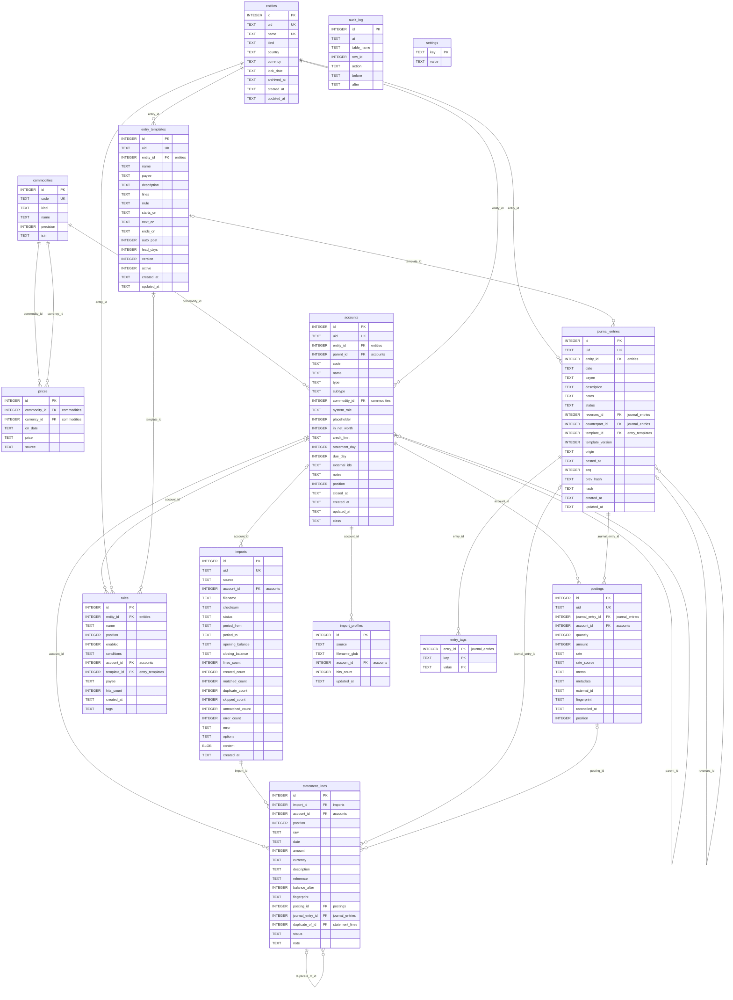

# Entity-relationship diagram

Generated from `crates/means-core/migrations/` by `scripts/gen_erd.py`; regenerate after a migration, never edit.
Field semantics live in `docs/data-model.md` section 3. Money columns are INTEGER counts of their commodity's minor unit (D14); dates are TEXT `YYYY-MM-DD`.

